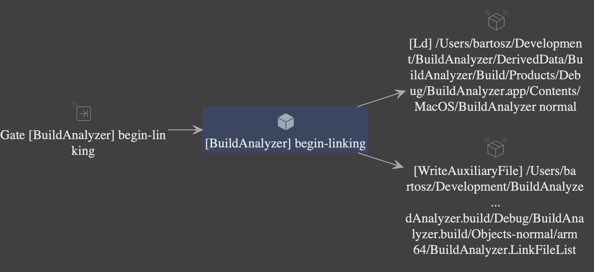
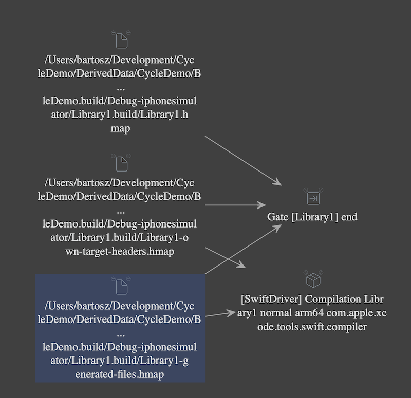
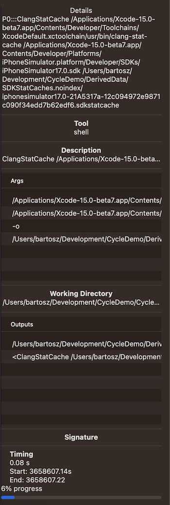
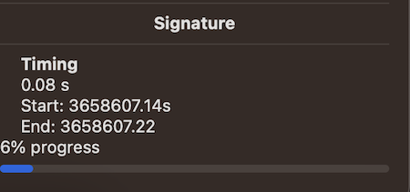
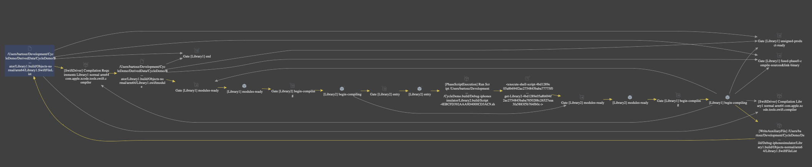

#  XCBuildAnalyzer

macOS app to inspect Xcode's build system graph

## Description


## Getting Started

To analyze your most recent build system graph, drag&drop a project file to the application area. Depending on a size of a project and nodes in a graph, it may take some time but usually should finish within couple of seconds.

On a left pane you will see graph nodes aggregated by target names (if applicable). The build graph is very often massive so to improve the reliability and performance, analyzing a subgraph is recommended.

Selecting a node will render a view with all input and output nodes in the center view.



If a node has some hidden input or outputs that were skipped for brevity, the node's icon ⤡ or ⤢ allow expanding them.


Selecting multiple nodes (using ⌘ or ⇧) in a left view draws the possible subgraph that includes all nodes.

<details>
  <summary>Screenshot</summary>



</details>

On a right pane, you can inspect step details including input/output nodes, step tool, ENV variables etc.

<details>
  <summary>Screenshot</summary>



</details>

If a build timing data was found along the build manifest, steps that were triggered in the most recent build have timing data. Look for 🔨 icons to found nodes that were recently executed.

<details>
  <summary>Screenshot</summary>



</details>


#### Cycles

If a cycle has been found in the graph, affected nodes have a warning sign. Selecting them draws the full cycle (with some few side nodes):


<details>
  <summary>Screenshot</summary>



</details>

### Requirements

* Building a project with Xcode 15+

### Supported formats

- [x] `*.xcodeproj`
- [x] `.xcworkspace`
- [x] `Package.swift`
- [x] `manifest.json`

### Installing

#### Running from a binary

* Open the most recent [released version](https://github.com/polac24/XCBuildAnalyzer/releases)
* Download&unzip the binary
* Run XCBuildAnalyzer.app

#### Building a project locally

* open BuildAnalyzer.xcodeproj
* [Optional] pick BuildAnalyzer scheme
* Run the app with ⌘+R


## Authors

Contributors names and contact info:

* Bartosz Polaczyk [@polac24](https://github.com/polac24)

## License

This project is licensed under the [Apache License](LICENSE)

```
Copyright (c) 2023 Bartosz Polaczyk.

Licensed to the Apache Software Foundation (ASF) under one
or more contributor license agreements.  See the NOTICE file
distributed with this work for additional information
regarding copyright ownership.  The ASF licenses this file
to you under the Apache License, Version 2.0 (the
"License"); you may not use this file except in compliance
with the License.  You may obtain a copy of the License at

http://www.apache.org/licenses/LICENSE-2.0

Unless required by applicable law or agreed to in writing,
software distributed under the License is distributed on an
"AS IS" BASIS, WITHOUT WARRANTIES OR CONDITIONS OF ANY
KIND, either express or implied.  See the License for the
specific language governing permissions and limitations
under the License.
```

## Acknowledgments

* [SQLite.swift](https://github.com/stephencelis/SQLite.swift)
* [CryptoSwift](https://github.com/krzyzanowskim/CryptoSwift)

This product includes software developed by the "Marcin Krzyzanowski" (http://krzyzanowskim.com/)
